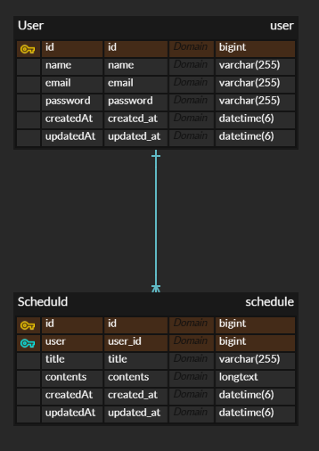

# Spring Boot Schedule Management API

## 프로젝트 개요

Spring Boot 기반의 일정 관리 REST API 프로젝트입니다. 사용자는 일정(CRUD)과 유저 관리(CRUD)를 수행할 수 있으며, 로그인 기능을 통해 인증/인가를 처리합니다.

## 기술 스택

Framework: Spring Boot 3.x

Language: Java 17+

Database: MySQL

ORM: Spring Data JPA

Authentication: Session & Cookie

Build Tool: Gradle

IDE: IntelliJ IDEA

## 프로젝트 구조

    src/
    ├── main/
    │   ├── java/com/example/schedule/
    │   │   ├── config/        # 설정 관련 클래스 (JPA Auditing, Security 등)
    │   │   ├── controller/    # API 컨트롤러
    │   │   ├── dto/           # 요청 및 응답 DTO
    │   │   ├── entity/        # JPA 엔티티
    │   │   ├── repository/    # JPA Repository
    │   │   ├── service/       # 비즈니스 로직 서비스
    │   ├── resources/
    │   │   ├── application.yml  # 환경 설정 파일

## 요구 사항

Java 17 이상

MySQL 8.0 이상

Gradle 8.x

## 주요 기능

### ✅ 유저 관리 (CRUD)

유저 회원가입 (POST /users/register)

유저 조회 (GET /users/{id})

유저 수정 (PUT /users/{id})

유저 삭제 (DELETE /users/{id})

### ✅ 일정 관리 (CRUD)

일정 생성 (POST /schedules)

일정 조회 (GET /schedules)

일정 수정 (PUT /schedules/{id})

일정 삭제 (DELETE /schedules/{id})

### ✅ 로그인/인증

로그인 (POST /login)

로그아웃 (POST /logout)

세션 기반 인증

## API 명세서

|HTTP Method | Endpoint        | 설명                         | 요청 예시                                                                           | 응답 예시
|------|-----------------|----------------------------|---------------------------------------------------------------------------------|---|
|POST | /users/register | 유저 회원가입                    | { "name": "홍길동", "email": "test@example.com", "password": "1234" }              |{ "id": 1, "name": "홍길동", "email": "test@example.com", "createdAt": "0000-00-00T00:00:00.0000000", "updatedAt": "0000-00-00T00:00:00.0000000" }
|GET | /users/{id}     | 유저 조회                      | -                                                                               | { "id": 1, "name": "홍길동", "email": "test@example.com", "createdAt": "0000-00-00T00:00:00.0000000", "updatedAt": "0000-00-00T00:00:00.0000000" }
|PUT | /users/{id}     | 유저 수정                      | { "oldPassword": "1233", "name": "이순신", "email": "test@example.com", "newPassword": "1111" } | { "id": 1, "name": "이순신", "email": "test@example.com", "createdAt": "0000-00-00T00:00:00.0000000", "updatedAt": "0000-00-00T00:00:00.0000000" }
|DELETE | /users/{id}     | 유저 삭제                      | -                                                                               | { "message": "삭제 완료" }
|POST | /schedules      | 일정 생성                      | { "title": "회의", "content": "팀 회의" }                                            | { "id": 1, "title": "회의", "content": "팀 회의" }
|GET | /schedules      | 일정 전체 조회                   | -                                                                               | [ { "id": 1, "title": "회의", "content": "팀 회의" } ]
|GET | /schedules/{id}  | 특정 일정 조회                   | -                                                                               | { "id": 1, "title": "회의", "content": "팀 회의" }
|PUT | /schedules/{id} | 일정 수정  | { "content": "팀 회의" }                                
|DELETE | /schedules/{id} | 일정 삭제                      | -                                                                               | { "message": "삭제 완료" }
|POST | /login          | 로그인                        | { "email": "test@example.com", "password": "1234" }                             | { "message": "로그인 성공" }
|POST | /logout         | 로그아웃                       | -                                                                               | { "message": "로그아웃 완료" }

## EDR

